# Weekend Wizard: Project Presentation 🧙‍♂️

Welcome to the **Weekend Wizard** project overview. This document is designed to provide a comprehensive and professional look at the architecture, features, and technology that power this AI agent.

## The Vision
**Weekend Wizard** is more than just a chatbot; it's a personalized AI assistant designed to simplify your weekend planning.

- **Objective**: Automate the tedious parts of planning (checking weather, finding books, getting entertainment).
- **Core Value**: Local-first AI that understands user preferences and acts on them using real-world tools.

---

## Architecture: The ReAct Loop
The agent operates on the **Reasoning and Acting (ReAct)** paradigm.

```mermaid
graph TD
    User([User Message]) --> Agent{AI Agent}
    Agent -->|Reasoning| Thought[Thought: 'I need to check the weather']
    Thought -->|Action| Tool[Call MCP Tool]
    Tool -->|Observation| Result[Tool Result: 'Sunny, 25°C']
    Result --> Agent
    Agent -->|Final Answer| User
```



---

## Technology Stack
Built with cutting-edge, local-first technologies.

| Layer | Technology |
| :--- | :--- |
| **Brain** | Mistral 7B (via Ollama) |
| **Protocol** | Model Context Protocol (MCP) |
| **Backend** | FastAPI / Python |
| **Frontend** | Vanilla JS / CSS |
| **Infrastructure**| Fully Local (Private & Secure) |

---

## Intelligent Tools
Equipped with a suite of custom MCP tools.

- 🌦️ **Weather**: Real-time conditions via Open-Meteo.
- 📚 **BookRecs**: Hyper-personalized suggestions from Open Library.
- 📍 **Geocoding**: Accurate city-to-coordinate translation.
- 🐕 **Entertainment**: Jokes, trivia, and dog photos.

---

## User Personalization
The agent adapts to you, not the other way around.

- **Preferences**: Stored in `prefs.json`.
- **Dynamic Context**: The agent automatically incorporates your favorite genres and home city into its reasoning process.
- **Privacy**: No data leaves your machine; everything stays local.

---

## 🛠️ System Overview

### The ReAct Loop in Action
When you ask, *"I'm in Tokyo, should I read a sci-fi book outside?"*, the agent:
1.  **Reason**: Determines it needs current weather for Tokyo.
2.  **Act**: Calls `city_to_coords` and then `get_weather`.
3.  **Reason**: If it's raining, it suggests staying in. If sunny, it suggests a book.
4.  **Act**: Calls `book_recs` using the favorite genre from your preferences.
5.  **Final Response**: Provides a cohesive, multi-step recommendation.

### Model Context Protocol (MCP)
By using MCP, we decouple the agent's logic from its tools. This allows for:
- **Extensibility**: Easily add new tools (e.g., Spotify, Google Calendar).
- **Security**: The agent only has access to the tools we explicitly provide.

---

## 📁 Project Structure

```bash
weekend-wizard/
├── src/            # Intelligence: Agent logic & MCP server
├── templates/      # Experience: Interactive Web UI
├── config/         # Memory: User preferences & settings
└── start_web.py    # Gateway: Robust server startup script
```

---

## 📈 Future Roadmap
- 📅 **Calendar Integration**: Automatically block off time for your planned activities.
- 🍽️ **Restaurant Discovery**: Find the best local spots based on your mood.
- 📱 **Mobile App**: Weekend planning on the go.
